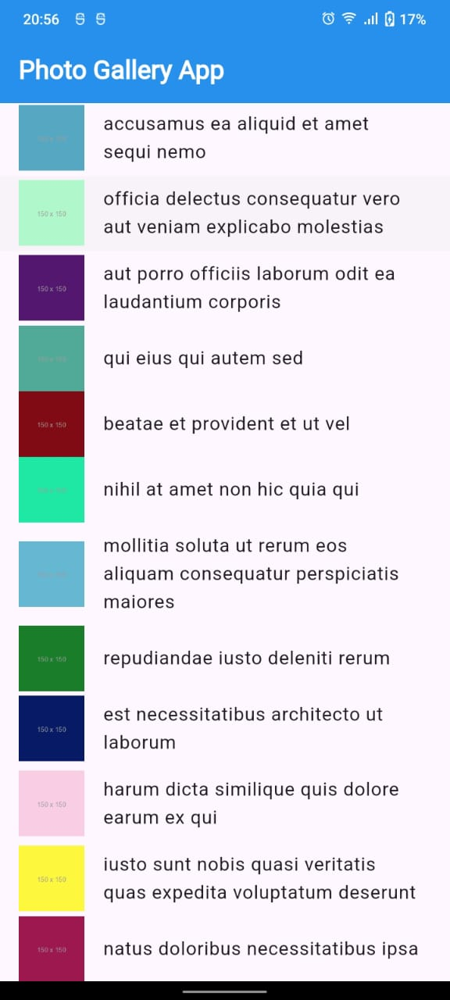

# photo_gallery2

A new Flutter project Using Rest API.

Explanation:
*Dependencies: The http package is used to fetch data from a REST API.
*Model Class: The Photo class represents the photo data.
*Fetching Data: The fetchPhotos function fetches a list of photos from a REST API endpoint (https://jsonplaceholder.typicode.com/photos).
*UI Structure:
PhotoListScreen fetches and displays the list of photos.
Each list item displays a thumbnail and the photo title.
Tapping on a list item navigates to PhotoDetailScreen, which displays the photo's details.
